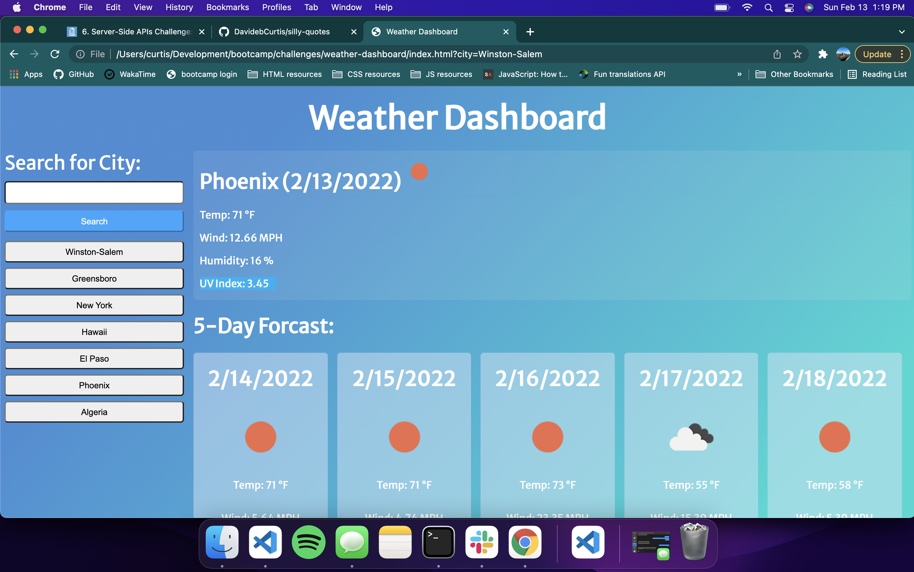

# weather-dashboard

Easy to use weather app to check out the weather for the current date plus a five day forcast!

I used OpenWeathers API to create a weather dashboard that grabs the most recent weather for the city of your choosing. 
This is dynamically updated on the page in real time without reloading the application.
Not only can you search for cities and get the weather but by implementing local storage you are able to check out the recent searches and get that weather with one click of your button.

Acceptance criteria include:
```
GIVEN a weather dashboard with form inputs
WHEN I search for a city
THEN I am presented with current and future conditions for that city and that city is added to the search history
WHEN I view current weather conditions for that city
THEN I am presented with the city name, the date, an icon representation of weather conditions, the temperature, the humidity, the wind speed, and the UV index
WHEN I view the UV index
THEN I am presented with a color that indicates whether the conditions are favorable, moderate, or severe
WHEN I view future weather conditions for that city
THEN I am presented with a 5-day forecast that displays the date, an icon representation of weather conditions, the temperature, the wind speed, and the humidity
WHEN I click on a city in the search history
THEN I am again presented with current and future conditions for that city
```



Check it out here!
https://davidebcurtis.github.io/weather-dashboard/
